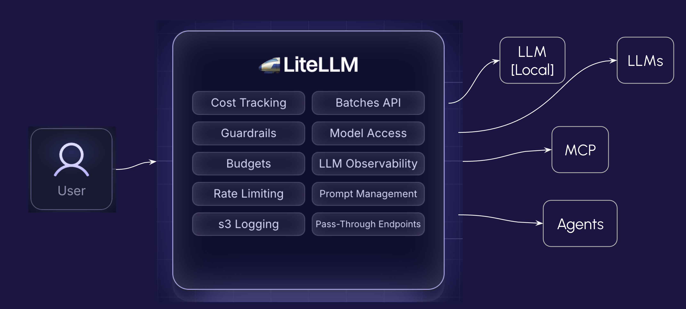
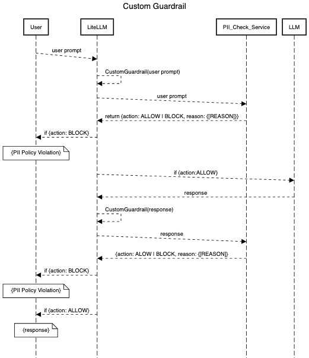

# LiteLLM Custom Guardrails

## Introduction

Before we begin, let's take a moment to built some context - ["Introduction"](https://docs.google.com/presentation/d/113l37j2Iu_cNM3habuHdruPWsan5Ng_iw6t_zEbaOUQ/edit?usp=sharing)

## Challenges

As we have see from the "Introduction", there are serious concerns especially when using in Enterprises. Here are a few:

- Data & Knowledge
  - Data quality & freshness
  - Data privacy (PII, Sensitive data, etc.)
- Security & Access:
  - RBAC access
  - Data breaches
  - Model poisoning
  - Model misuse
- Governance:
  - Audit loggins and traceability
  - Compliance with standards (PCI, GDPR, HIPPA, etc.)
  - Compliance with regulations (Audits, Compliance, etc.)
- Cost:
  - Spend Tracking (Token usage, Cost, etc.)
  - Budget (Limits, Quotas, etc.)

## Solution

To address these concerns, we need a centralized system that can monitor and control the use of LLMs. Some of the key capabilities of this system:

- A centralized platform to access & use multiple LLMs
- Support guardrails to Control data quality and privacy
- Highly resilient and performant
- Easy to deploy and manage

One such system/platform is [LiteLLM](https://www.litellm.ai/) - It brings all these capabilities into one simple to manage LLM Gateway.


## Installation

### Pre-Requisites

Please ensure the following pre-requisites have been installed:

- Access to an LLM - Local, Cloud, or AWS Bedrock
- LLM Access Keys (If connecting to a remote LLM)
- Docker (To run LiteLLM Proxy)
- Python (To create custom guardrails)
  - pip
- Postman (To test the API)
- Kubernetes
  - Kubectl
  - Helm


### Installation Steps

#### Deploy LiteLLM Proxy

**Step-1:** Install LiteLLM locally in Docker
Change directory into "litellm-proxy" and complete the following steps.
- Pull the LiteLLM database image

```
      $ docker pull ghcr.io/berriai/litellm-database:main-latest
```

- Download the docker compose file

```
      $ curl -O https://raw.githubusercontent.com/BerriAI/litellm/main/docker-compose.yml
```

- Add the master key - you can change this after setup

```
      $ echo 'LITELLM_MASTER_KEY="<YOUR_MASTER_KEY>"' > .env
```
*NOTE: default is "sk-1234"*

- Add the litellm salt key. Used to encrypt/decrypt your LLM API key credentials

```
      $ echo 'LITELLM_SALT_KEY="<YOUR_SALT_KEY>"' >> .env
```
*NOTE: default is "sk-1234"*

- Create the “config.yaml” file as follows:

```
      general_settings:
  	    master_key: os.environ/LITELLM_MASTER_KEY
  	    database_url: "postgresql://llmproxy:dbpassword9090@db:5432/litellm"
```

- Create the prometheus.yml file as follows:

```
      global:
        scrape_interval: 15s
        evaluation_interval: 15s

      scrape_configs:
        - job_name: "litellm"
          static_configs:
            - targets: ["litellm:4000"]
```

- Edit the docker-compose.yaml file and verify that the config.yaml volume mount and --config flag are not commented out:

```
      services:
        litellm:
          volumes:
            - ./config.yaml:/app/config.yaml # ✅ must be uncommented
          command:
            - "--config=/app/config.yaml" # ✅ must be uncommented
```

**Step-2:** Start the proxy server and test it
``` $ docker compose up ```

**Step-3:** Navigate to the LiteLLM UI and generate a virtual key
Open http://localhost:4000/ui in your browser and log in with your master key (*default: sk-1234*).

### Configure LLMs

- Configure a local LLM such as llama3.2. Edit config.yml file and add following lines

```
    model_list:
        - model_name: "llama3.2"
          litellm_params:
            model: "ollama_chat/llama3.2"
            api_base: "http://host.docker.internal:11434"
```

- Configure OpenAI LLM. Edit .env file and set your OPENAI_API_KEY

```
      OPENAI_API_KEY="sk-proj-********"
```

- Edit config.yml file - under model_list, add the following lines:

```
      - model_name: openai-gpt-4o
        litellm_params:
          model: "openai/gpt-4o"
          api_key: os.environ/OPENAI_API_KEY
```

---
# Create a Custom Guardrail

## Custom Guardrail - using RegEx
### Sequence Diagram


### PII Check Service - running on localhost:5001
- Create a python program ["pii_check_service.py"](https://github.com/srinihashi/pii_check_service/blob/main/pii_check_service.py) that will run as a service with the "/check" endpoint. Using regex this endpoint will idetify PII patterns and return action=<ALLOW or BLOCK> along with the reason=<[{'type': '<US_SSN|EMAIL>'}]>.

- Start the app.py service (running on port 5001) and test if its live by calling the "/health" endpoint.

- Create a python program ["custom_pii_guardrail_api.py"](./guardrails/custom_pii_guardrail_api.py) that will use the CustomGuardrail class and implement the apply_guardrail() method.

- Edit the .env file and set the "MY_GUARDRAIL_BASE_API_URL" to point to the app.py service.
  - http://host.docker.internal:5001 (for Docker) or http://127.0.0.1:5001 (for localhost)

- Edit the config.ymll file and configure the new guardrail ("custom_pii_guardrail")
Add the following lines:
```
guardrails: 
  - guardrail_name: "my-custom-pii-guardrail-api"
    litellm_params:
      guardrail: custom_pii_guardrail_api.myCustomGuardrailAPI  # 👈 Key change
      mode: ["pre_call", "post_call", "during_call"]               # runs apply_guardrail method
      default_on: False
      api_base: os.environ/MY_GUARDRAIL_BASE_API_URL
```

- Edit the docker-compose.yaml file and add a new volume to the Custom Guardrail ("custom_pii_guardrail_api")

```
    volumes:
      - ./config.yml:/var/config.yml
      - ./guardrails/custom_pii_guardrail_api.py:/var/custom_pii_guardrail_api.py # ✅ add this line
```

- Restart Litellm
```
docker-compose down
docker-compose up -d
```

- Test your new custom guardrail
Login to the [Litellm UI](http://localhost:4000/ui/) and test the new custom guardrail.


### PII Check Service - running in Kubernetes
- Create a helm chart for the custom guardrail
See helm chart [here](https://github.com/srinihashi/pii_check_service/tree/main/k8s_deployment/helm/check-microservice)


- Create a docker image of the check_pii_service
```
      docker build -t pii_checkservice:1.0.0 .
```

- Udate the my-values.yaml file with correct image name
```
      image:
        repository: pii_check_service # ✅ check if the image name is correct
        pullPolicy: IfNotPresent
        # Overrides the image tag whose default is the chart appVersion.
        tag: "1.0.1" # ✅ check if image version is correct
```

- Deploy the PII Check Service in Kubernetes
```
      helm install check_pii_service helm/check-microservice -f my-values.yaml
```
- Set port-forward (6001 --> 5001) to access the pii_check_service running in Kubernetes

- Configure a new Custom Guardrail in Litellm to use this endpoint (http://localhost:6001)
